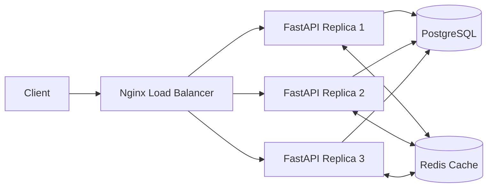
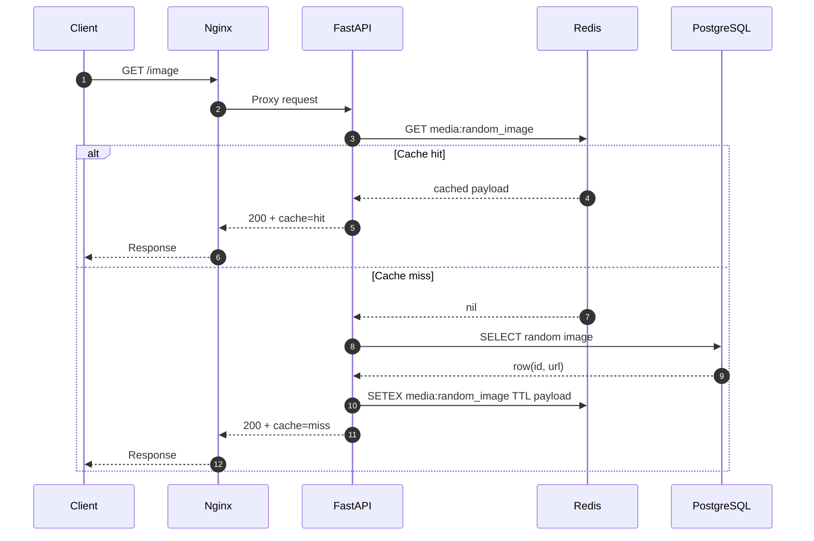
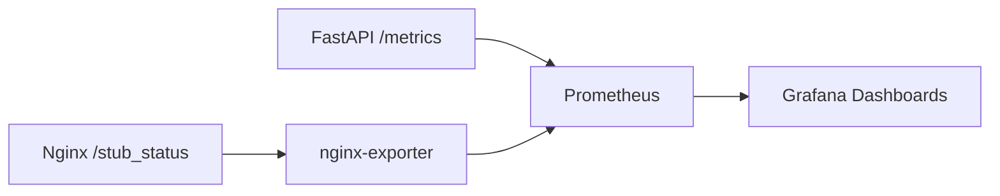
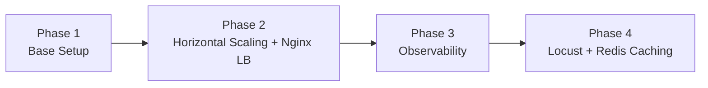
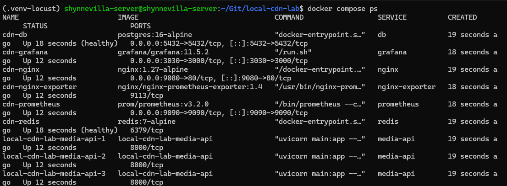
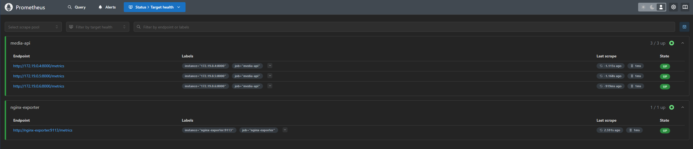
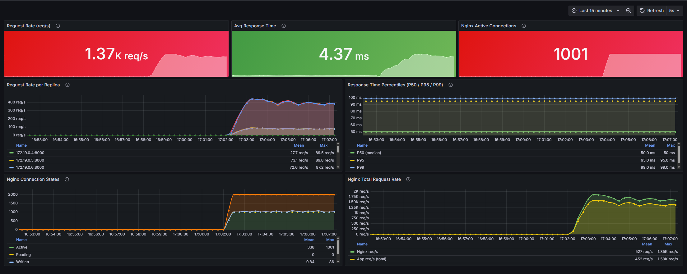
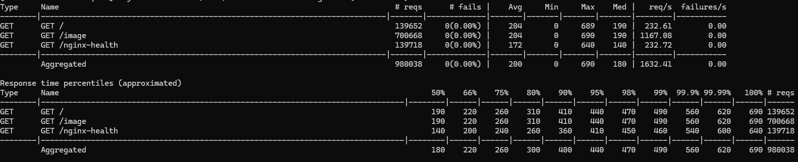
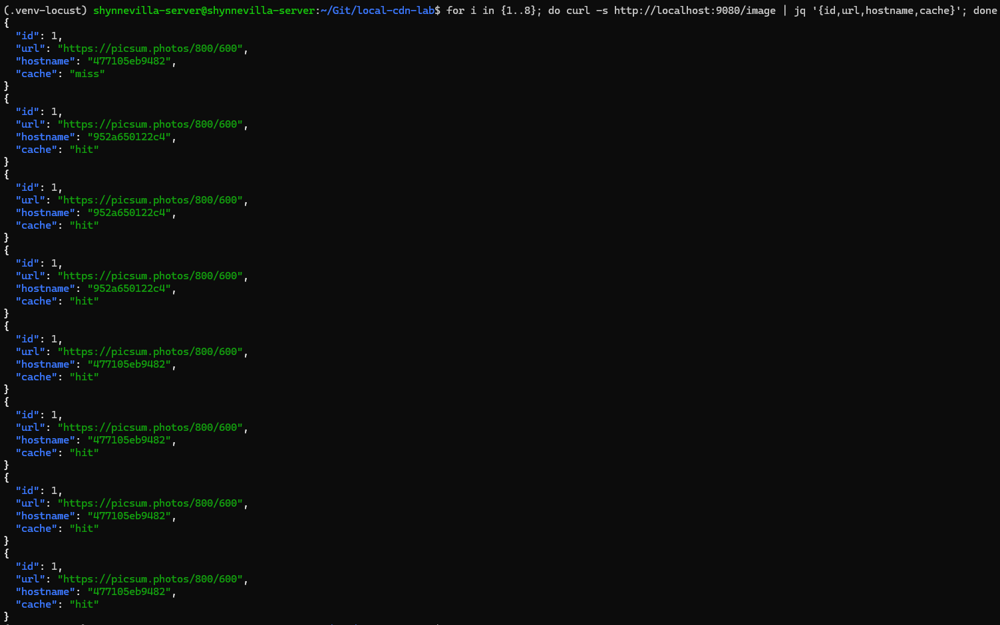
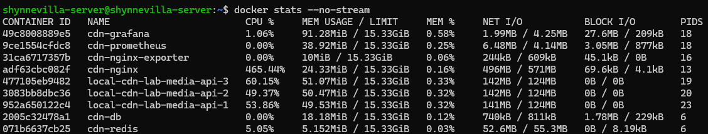

# Local CDN Lab - High-Availability Media Hosting

This homelab project simulates a zero-cost high-availability media hosting architecture using Docker Compose and open-source tooling.

## 1. Objectives

- Build a media hosting system that can handle high concurrent traffic.
- Reach 1000 concurrent users without crashing the system.
- Add observability (metrics + dashboards) for performance analysis.

## 2. Tech Stack

- Infrastructure: Docker, Docker Compose
- App/Backend: FastAPI
- Database: PostgreSQL
- Load Balancer: Nginx
- Caching: Redis
- Monitoring: Prometheus, Grafana
- Load Testing: Locust

## 3. High-Level Architecture



### 3.1 Request Flow (Cache Hit vs Cache Miss)



### 3.2 Observability Flow



## 4. Quick Start

### 4.1 Start the stack

```bash
docker compose down
docker compose build media-api
docker compose up -d --scale media-api=3
```

### 4.2 Health checks

```bash
docker compose ps
docker exec cdn-nginx nginx -t
curl -s http://localhost:9080/ | jq
curl -s http://localhost:9090/api/v1/targets | jq '.data.activeTargets[] | {job: .labels.job, instance: .labels.instance, health: .health}'
```

### 4.3 Dashboards

- Grafana: http://localhost:3030
- Prometheus: http://localhost:9090

## 5. Phase Mapping

- Phase 1: PostgreSQL + single app instance
- Phase 2: Horizontal scaling to 3 app replicas + Nginx load balancing
- Phase 3: Prometheus + Grafana + Nginx exporter + dashboard provisioning
- Phase 4: Locust stress testing + Redis caching



## 6. Benchmark Results (Phase 4)

### 6.1 Test command

```bash
locust -f locustfile.py --host http://localhost:9080 --users 1000 --spawn-rate 50 --run-time 10m --headless --only-summary
```

### 6.2 Measured results

| Metric | Value |
|---|---|
| Concurrent users | 1000 |
| Run time | 10 minutes |
| Total requests | 980038 |
| Fail rate | 0.00% |
| Total throughput (aggregated req/s) | 1632.41 req/s |
| Average latency (aggregated) | 200 ms |
| P95 (aggregated) | 440 ms |
| P99 (aggregated) | 490 ms |
| Max latency (aggregated) | 690 ms |

### 6.3 Notes

- The system sustained 1000 concurrent users for 10 minutes without crashing.
- No failed requests were observed in this run (0%).
- Locust reported CPU > 90% on the load generator, so throughput and latency measurements may be partially constrained by the load client machine.

## 7. Screenshots and Reproducible Commands

### 7.1 Docker Compose status

Command used:

```bash
docker compose ps
```



### 7.2 Prometheus targets (all targets UP)

Open in browser:

```bash
http://localhost:9090/targets
```

CLI validation command:

```bash
curl -s http://localhost:9090/api/v1/targets | jq '.data.activeTargets[] | {job: .labels.job, instance: .labels.instance, health: .health}'
```



### 7.3 Grafana dashboard at peak load

Open in browser:

```bash
http://localhost:3030
```

Capture timing:

- Start Locust load test.
- Wait about 1 to 2 minutes after all users are spawned.
- Capture the dashboard while request rate and latency charts are stable.



### 7.4 Locust final summary

Command used:

```bash
locust -f locustfile.py --host http://localhost:9080 --users 1000 --spawn-rate 50 --run-time 10m --headless --only-summary
```

Note:

- This screenshot must be taken after the run-time limit is reached and the final table is printed.



### 7.5 Cache behavior (miss -> hit)

Command used:

```bash
for i in {1..8}; do curl -s http://localhost:9080/image | jq '{id,url,hostname,cache}'; done
```

Expected behavior:

- First request is typically cache=miss.
- Next requests should become cache=hit within the TTL window.



### 7.6 Runtime resource snapshot

Command used:

```bash
docker stats --no-stream
```

Capture timing:

- Run this command while Locust is actively generating load.



## 8. Limitations and Improvements

- Load generator is not isolated from the system under test.
- No strict A/B benchmark yet for cache on vs cache off under identical hardware constraints.
- Container resource limits (CPU/memory) are not enforced yet for fault-isolation testing.

Planned next steps:

- Run distributed Locust (master/worker) on dedicated machines.
- Execute formal cache on/off A/B tests.
- Add Prometheus alert rules for latency, error rate, and container restarts.

## 9. Repository Structure

```text
.
|-- app/
|   |-- main.py
|   `-- requirements.txt
|-- grafana/
|   `-- provisioning/
|       |-- dashboards/
|       `-- datasources/
|-- nginx/
|   `-- nginx.conf
|-- prometheus/
|   `-- prometheus.yml
|-- docker-compose.yml
|-- docs/
|   `-- images/
|       |-- phase4-cache-hit-miss.png
|       |-- phase4-compose-ps.png
|       |-- phase4-docker-stats.png
|       |-- phase4-grafana-peak.png
|       |-- phase4-locust-summary.png
|       `-- phase4-prometheus-targets.png
|-- Dockerfile
`-- locustfile.py
```
